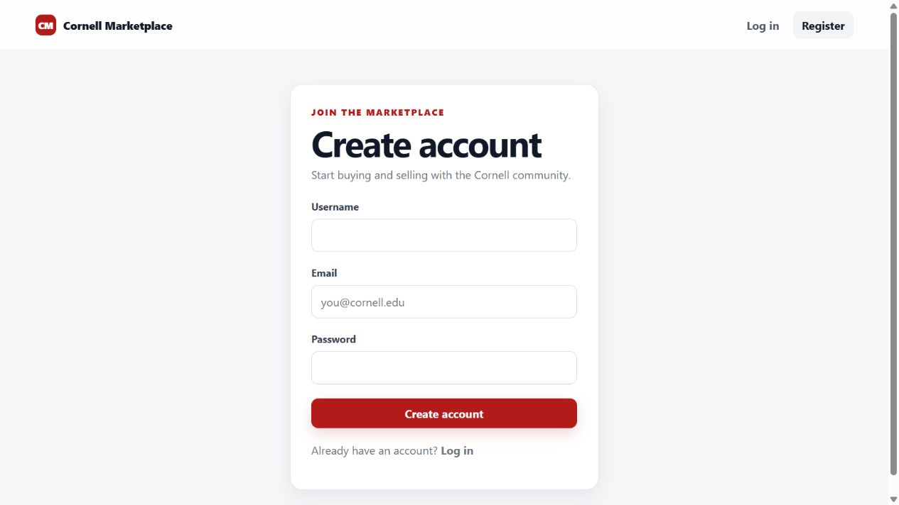

# Cornell Marketplace

A campus marketplace with Cornell email verification, seller-owned listings, title search, and photo uploads. The backend uses Java 17, Spring Boot, Spring Security, and PostgreSQL; the frontend uses React, TypeScript, and Vite. Photos are stored in S3.



Registration screen captured October 8, 2026. The public listing feed was empty during this check; no account was submitted.

## What's implemented

Students register with a Cornell email address, verify a six-digit email code, and log in with a JWT. A listing includes a title, description, price, photo, pickup location, and seller. Sellers can edit or delete their own listings; the API checks ownership using the authenticated user.

A few implementation details:

- Passwords are hashed with BCrypt. Email addresses are normalized before registration, verification, and login.
- Registration and code resends are transactional. If SMTP delivery fails, the database changes roll back; a failed resend preserves the previous code.
- Password hashes and verification codes are excluded from user and listing JSON.
- The frontend preserves a session during a network failure and offers a retry. An invalid or expired token clears the session.
- Search uses Spring Data's `findByTitleContainingIgnoreCase`. It is a case-insensitive title substring search.

## Local setup

Use Java 17, Node 24, a PostgreSQL database, an S3 bucket, and an SMTP account that can send verification emails.

The backend reads process environment variables. Spring Boot does **not** automatically load `backend/.env`; use [backend/.env.example](backend/.env.example) as a reference and set the values in your shell.

| Service | Environment variables |
| --- | --- |
| PostgreSQL | `DB_URL`, `DB_USERNAME`, `DB_PASSWORD` |
| JWT | `JWT_SECRET` |
| S3 | `AWS_ACCESS_KEY`, `AWS_SECRET_KEY`, `AWS_BUCKET`, `AWS_REGION` |
| Email | `MAIL_HOST`, `MAIL_PORT`, `MAIL_USERNAME`, `MAIL_PASSWORD`, `MAIL_FROM` |

`JWT_SECRET` must be a Base64-encoded random key of at least 32 bytes. `JWT_EXPIRATION` is in milliseconds and defaults to one hour. Use a mail sender permitted by your SMTP provider.

Start the backend:

```powershell
cd backend
.\mvnw.cmd spring-boot:run
```

On macOS/Linux, use `bash ./mvnw spring-boot:run`. In a second terminal:

```bash
cd frontend
npm ci
npm run dev
```

Vite proxies `/auth`, `/users`, and `/listings` to `http://localhost:8080`. Registration needs working email delivery; verification is required before login.

## Checks

```powershell
cd backend
.\mvnw.cmd test
cd ../frontend
npm test
npm run build
npm run lint
```

Use `bash ./mvnw test` on macOS/Linux. Backend tests start the application with H2, real BCrypt/JWT/security filters, and mocked email and S3 calls. They cover registration through login, malformed requests, verification expiry, email rollback, secret serialization, and listing permissions. Frontend tests cover authentication responses and session loading.

These tests do not verify a deployed PostgreSQL database, email delivery, or S3 permissions.

## Hosting and current limits

Set `VITE_API_URL` to the public backend origin before building the frontend, with **no `/api` suffix**. Set backend `CORS_ALLOWED_ORIGINS` to the frontend origin. Alternatively, reverse-proxy the three API route prefixes to the backend and leave `VITE_API_URL` empty. The Vite development proxy is absent from a production build; an SPA fallback must not turn API requests into HTML.

The app handles listings and accounts; it has no checkout or in-app messaging. Listing retrieval and search are unpaginated. Hibernate currently uses `ddl-auto=update` rather than versioned database migrations.

The repository contains no reproducible search benchmark or index migration, so no query-speed improvement is claimed here.
